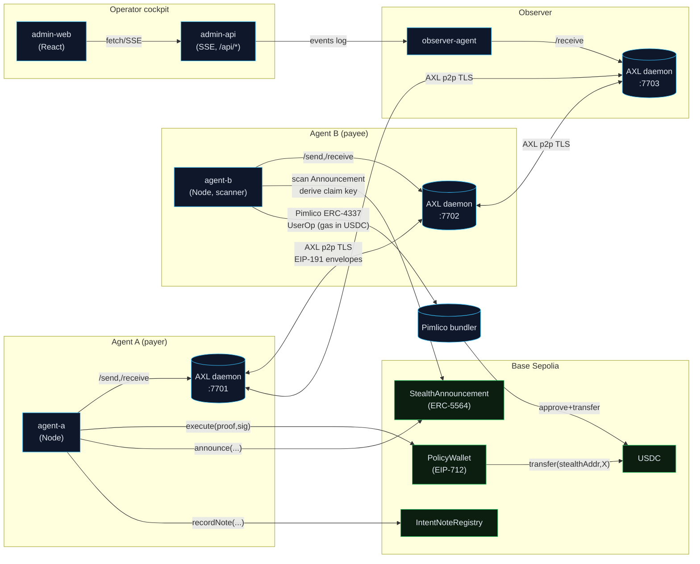

# IntentLayer Protocol

> **The first protocol to compose ERC-5564 stealth addresses, ERC-8004 agent identity, ERC-4337 gasless sweeps, and Gensyn AXL encrypted p2p mesh into a single trust layer for autonomous AI-agent payments.**

No central relay. No raw private-key exposure. No unauditable transactions.

---

## What is IntentLayer?

IntentLayer lets two AI agents settle a payment end-to-end without either agent ever knowing the other's real wallet address, and without a central intermediary brokering the transaction.

**Agent A** (payer) locks a policy on-chain, signs an EIP-712 `IntentProof`, and sends it over Gensyn AXL.  
**Agent B** (payee) validates the proof, runs a Tenderly simulation, accepts, and watches for its stealth USDC delivery — then sweeps it gaslessly via Pimlico ERC-4337.  
**Observer** + **Admin Dashboard** give the operator full real-time visibility into every stage without ever touching a private key.

---

## Five EIPs, One Payment

| Stage                       | Standard  | What it gives us |
|-----------------------------|-----------|-----------------|
| Agent identity / discovery  | ERC-8004  | Each agent publishes a card; peers resolve via on-chain registry |
| Intent proof signing        | EIP-712   | Typed, `policyHash`-bound, replay-safe signed intent |
| AXL envelope authentication | EIP-191   | Every AXL message signed by sender; verified before any policy work |
| Stealth payment derivation  | ERC-5564  | Fresh stealth address per payment via SECP256K1 ECDH + `viewTag` |
| Gasless USDC sweep          | ERC-4337  | Pimlico token-paymaster pays gas in USDC — no ETH needed |

All five compose over a single transport: **Gensyn AXL**.

---

## Architecture



---

## Repository Layout

```
IntentLayer_v6_2/
├── intentlayer/               ← Active MVP (pnpm workspace)
│   ├── packages/
│   │   ├── contracts/         Foundry — PolicyWallet, StealthAnnouncement,
│   │   │                      IntentNoteRegistry, IdentityRegistry (ERC-8004)
│   │   ├── axl-transport/     TypeScript wrapper over AXL Go-binary HTTP API
│   │   ├── axl-mock/          In-process TS AXL daemon (dev / CI, no Go needed)
│   │   ├── intent-core/       EIP-712, policy, Tenderly, envelope, stealth, paymaster
│   │   ├── agent-identity/    Reads / registers ERC-8004 Agent Cards
│   │   ├── agent-a/           Standalone Node process — payer
│   │   ├── agent-b/           Standalone Node process — payee + stealth scanner
│   │   └── observer-agent/    AXL telemetry sink for admin monitoring
│   ├── apps/
│   │   ├── admin-api/         REST + SSE event stream (token-gated)
│   │   ├── admin-web/         Operator cockpit (React)
│   │   ├── telegram-wallet/   Telegram bot operator interface (Phase D)
│   │   └── mcp-server/        MCP server with 13 tools (Phase E)
│   ├── agent-cards/           ERC-8004 Agent Card JSONs
│   ├── demo/                  Runnable scenario scripts
│   ├── infra/                 axl-a.toml, axl-b.toml, axl-observer.toml
│   ├── scripts/               install-axl.sh, start-axl.sh, deploy scripts
│   ├── docs/                  AXL_SETUP.md, DEMO_STORYBOARD.md, MCP_SETUP.md, TELEGRAM_SETUP.md
│   ├── .env.example           All required environment variables (template)
│   └── pnpm-workspace.yaml
├── Intentlayer_hackathon_skill_mvp_prd_v2.md   Full PRD
└── graphify-out/              Knowledge graph (auto-generated)
```

---

## How to Run

**→ Full setup guide lives in [`intentlayer/README.md`](./intentlayer/README.md)**

### Prerequisites

| Tool    | Min version | Install |
|---------|-------------|---------|
| Node.js | 20          | https://nodejs.org |
| pnpm    | 9           | `npm i -g pnpm@9` |
| Go      | 1.21        | https://go.dev/dl/ (needed for real AXL binary) |
| Foundry | latest      | `curl -L https://foundry.paradigm.xyz \| bash && foundryup` |

### Quick Start (dev with mock AXL — no Go required)

```bash
cd intentlayer

# 1. Install JS dependencies
pnpm install

# 2. Copy and fill environment variables
cp .env.example .env
# Edit .env — minimum required keys:
#   DEPLOYER_PRIVATE_KEY, AGENT_A_PRIVATE_KEY, AGENT_B_PRIVATE_KEY
#   BASE_SEPOLIA_RPC_URL, PIMLICO_API_KEY, GEMINI_API_KEY
#   TENDERLY_ACCESS_KEY, TENDERLY_ACCOUNT_SLUG, TENDERLY_PROJECT_SLUG

# 3. Start mock AXL transport (dev path — no Go binary needed)
./scripts/start-axl-mock.sh

# 4. Deploy contracts to Base Sepolia
pnpm --filter @intentlayer/contracts build
pnpm deploy:fresh           # or: pnpm --filter @intentlayer/contracts deploy:identity && deploy:core

# 5. Generate Agent B stealth meta-keys (one-time)
pnpm tsx scripts/gen-stealth-keys.ts
# Copy the output into .env: AGENT_B_SPENDING_PRIVKEY, AGENT_B_VIEWING_PRIVKEY, AGENT_B_STEALTH_META

# 6. Start the operator stack (4 separate terminals)
pnpm agent:observer         # terminal 1
pnpm agent:b                # terminal 2
pnpm admin:api              # terminal 3
pnpm admin:web              # terminal 4

# 7. Trigger an A2A payment
pnpm agent:a                # terminal 5 (or click "Start Live A2A Payment" in the dashboard)
```

Open **http://localhost:5173** (or whatever port admin-web uses) to watch the live transaction flow.

### Production / Demo (real AXL Go binary)

```bash
cd intentlayer

# Build the AXL Go binary (one-time, needs Go 1.21+)
./scripts/install-axl.sh
export PATH="$HOME/.local/bin:$PATH"

# Boot 3 real AXL daemons
pnpm axl:real               # runs scripts/start-axl.sh
curl -s http://127.0.0.1:7701/topology | jq   # verify peers connected

# Then follow steps 4–7 from Quick Start above
```

---

## Key npm Scripts

| Script | Description |
|--------|-------------|
| `pnpm install` | Install all workspace dependencies |
| `pnpm build` | Build all packages |
| `pnpm test` | Run all test suites |
| `pnpm lint` | Lint all packages |
| `pnpm axl:real` | Start 3 real AXL Go daemons (prod) |
| `pnpm axl:mock` | Start in-process TS AXL daemon (dev/CI) |
| `pnpm axl:stop` | Stop all AXL daemons |
| `pnpm agent:a` | Start Agent A (payer) |
| `pnpm agent:b` | Start Agent B (payee + scanner) |
| `pnpm agent:observer` | Start Observer agent |
| `pnpm admin:api` | Start admin REST/SSE API |
| `pnpm admin:web` | Start operator dashboard UI |
| `pnpm telegram:start` | Start Telegram bot (Phase D) |
| `pnpm mcp:start` | Start MCP server (Phase E) |
| `pnpm deploy:fresh` | Full contract redeploy to Base Sepolia |
| `pnpm deploy:check` | Verify deployment status |
| `pnpm contracts:test` | Run Foundry contract tests |

---

## Phase Progress

| Phase | Description | Status |
|-------|-------------|--------|
| 1 | ERC-8004 Agent Identity | ✅ Complete |
| 2 | Foundation (contracts + AXL) | ✅ Complete |
| 3 | Intent Proof Engine (EIP-712) | ✅ Complete |
| 4 | Stealth A2A Payments (ERC-5564 + ERC-4337) | ✅ Complete |
| 5 | Operator Dashboard + Observer | ✅ Complete |
| v6-A | Privacy + safety bug-fix sprint | ✅ Complete |
| v6-B | Real AXL Go binary scripts | ✅ Complete |
| v6-C | Hackathon demo polish | ✅ Complete |
| v6-D | Telegram Agentic Wallet | ✅ Scaffolded |
| v6-E | MCP Server (13 tools) | ✅ Scaffolded |
| 6 | Uniswap Integration | ⏳ Deferred |
| v6-F | Testnet 72-hour soak | ⏳ Deferred |
| v6-G | Mainnet deployment | ⏳ Deferred |

---

## Security Rules (do not violate)

1. **AXL is the only transport** between agents — no direct agent-to-agent HTTP.
2. **Three separate AXL daemons** for live mode: Agent A (:7701), Agent B (:7702), Observer (:7703).
3. **No tx without a valid EIP-712 IntentProof** signature.
4. **Stealth is the default payment path** — agent-a's EOA never sends ETH to the stealth address.
5. **Base Sepolia** for development (chainId 84532).
6. **No private keys / mnemonics / API keys in git** — `.env` is gitignored.

---

## Documentation

| Doc | Description |
|-----|-------------|
| [`intentlayer/README.md`](./intentlayer/README.md) | Full developer setup guide |
| [`intentlayer/docs/AXL_SETUP.md`](./intentlayer/docs/AXL_SETUP.md) | AXL binary install + troubleshooting |
| [`intentlayer/docs/DEMO_STORYBOARD.md`](./intentlayer/docs/DEMO_STORYBOARD.md) | 4-minute judge-facing demo script |
| [`intentlayer/docs/TELEGRAM_SETUP.md`](./intentlayer/docs/TELEGRAM_SETUP.md) | Telegram bot operator setup |
| [`intentlayer/docs/MCP_SETUP.md`](./intentlayer/docs/MCP_SETUP.md) | MCP server + Claude Desktop config |
| [`intentlayer/v6phase.md`](./intentlayer/v6phase.md) | v6 hardening phase log |
| [`intentlayer/Phase.txt`](./intentlayer/Phase.txt) | Live phase progress tracker |
| [`intentlayer/FEEDBACK.md`](./intentlayer/FEEDBACK.md) | Gensyn AXL submission feedback |
| [`Intentlayer_hackathon_skill_mvp_prd_v2.md`](./Intentlayer_hackathon_skill_mvp_prd_v2.md) | Full Product Requirements Document |
