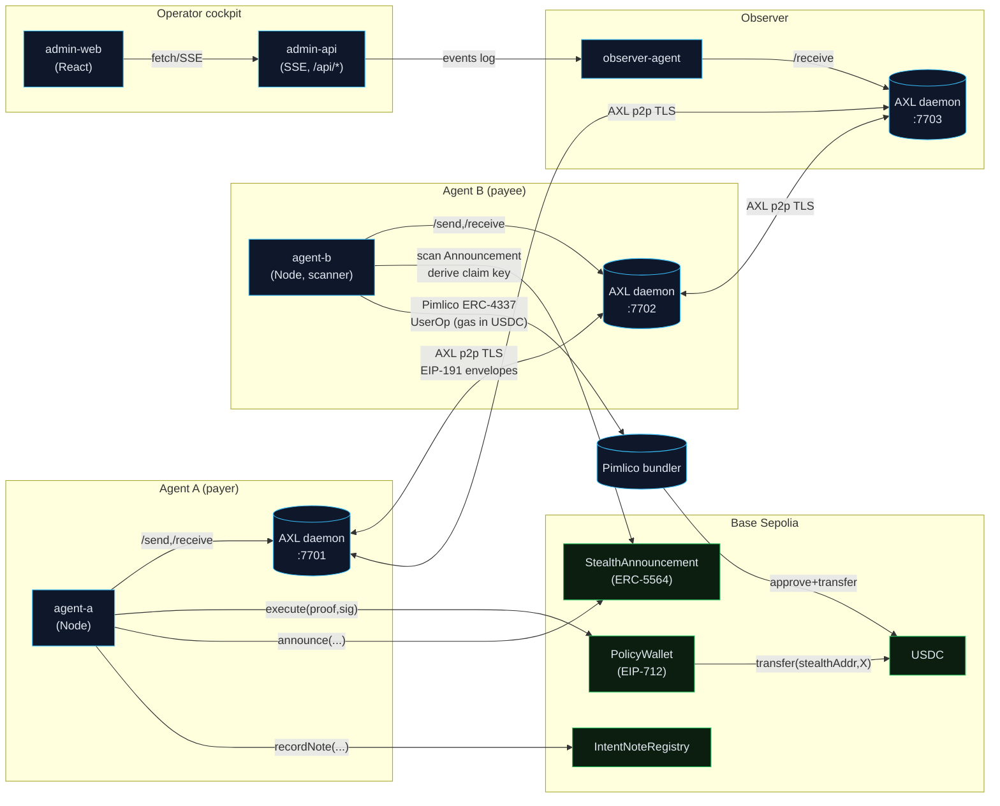

# IntentLayer MVP

> **Policy-enforced, stealth agent-to-agent payments over Gensyn AXL.**

This is the live IntentLayer A2A MVP: real Gensyn AXL transport, Base Sepolia policy-wallet execution, ERC-5564 stealth payments, ERC-8004 agent identity, Pimlico ERC-4337 gasless sweeps, and an admin/operator dashboard for monitoring every transaction stage.

---

## Phase Status

| Phase | Scope | Status |
|-------|-------|--------|
| 1 | ERC-8004 Agent Identity | ✅ |
| 2 | Foundation (contracts + AXL transport) | ✅ |
| 3 | Intent Proof Engine (EIP-712) | ✅ |
| 4 | Stealth A2A Payments (ERC-5564 + ERC-4337) | ✅ |
| 5 | Operator dashboard + Observer agent | ✅ |
| v6-A | Privacy + safety bug-fix sprint | ✅ |
| v6-B | Real AXL Go binary scripts | ✅ |
| v6-C | Hackathon demo polish | ✅ |
| v6-D | Telegram Agentic Wallet | ✅ (scaffold) |
| v6-E | MCP Server (13 tools, 4 resources) | ✅ (scaffold) |
| 6 | Uniswap Integration | ⏳ |

See [Phase.txt](./Phase.txt) for the live tracker · [v6phase.md](./v6phase.md) for the v6 hardening log.

---

## Why This Is Hard (Five EIPs in One Payment)

| Stage | Standard | What it gives us |
|-------|----------|-----------------|
| Agent identity / discovery | ERC-8004 | Each agent publishes a card; peers resolve via on-chain registry |
| Intent proof signing | EIP-712 | Typed, `policyHash`-bound, replay-safe signed intent |
| AXL envelope authentication | EIP-191 | Every AXL message signed by sender; verified before policy work |
| Stealth payment derivation | ERC-5564 | Fresh stealth address per payment via SECP256K1 ECDH + `viewTag` |
| Gasless USDC sweep | ERC-4337 | Pimlico token-paymaster pays gas in USDC — no ETH needed |

All five compose and the **only inter-agent transport is Gensyn AXL**.

---

## Architecture



**Privacy invariant (Phase A.1):** The only outbound transaction from agent-a's EOA is `PolicyWallet.execute`. No ETH ever flows from agent-a to the stealth address — the sweep gas is paid in USDC by Pimlico's token-paymaster on behalf of the stealth-address smart account.

---

## Repo Layout

```
intentlayer-mvp/
├── packages/
│   ├── contracts/          Foundry — PolicyWallet, IntentNoteRegistry,
│   │                       StealthAnnouncement, IdentityRegistry (ERC-8004)
│   ├── axl-transport/      TS wrapper over real AXL Go-binary HTTP API
│   ├── axl-mock/           In-process TS AXL daemon (dev/CI, no Go needed)
│   ├── intent-core/        EIP-712 + policy + Tenderly + envelope + stealth helpers
│   ├── agent-identity/     Reads / registers ERC-8004 Agent Cards
│   ├── agent-a/            Standalone Node process — payer
│   ├── agent-b/            Standalone Node process — payee + stealth scanner
│   └── observer-agent/     AXL telemetry sink for admin monitoring
├── apps/
│   ├── admin-api/          Local admin REST API + SSE event stream (token-gated)
│   ├── admin-web/          Operator cockpit UI (React)
│   ├── telegram-wallet/    Telegram bot for operator remote control (Phase D)
│   └── mcp-server/         MCP server with 13 tools + 4 resources (Phase E)
├── agent-cards/            ERC-8004 Agent Card JSONs
├── demo/                   Runnable scenario scripts (heartbeat, policy-block)
├── infra/                  axl-a.toml, axl-b.toml, axl-observer.toml
├── scripts/                install-axl.sh, start-axl.sh, deploy helpers
├── docs/                   AXL_SETUP.md, DEMO_STORYBOARD.md, MCP_SETUP.md,
│                           TELEGRAM_SETUP.md, axl-message-protocol.md
├── .skill/                 Skill cards for coding agents
├── Phase.txt               Live progress tracker
├── v6phase.md              v6 hardening + demo polish log
├── FEEDBACK.md             Gensyn submission feedback
├── .env.example            All required environment variables
└── pnpm-workspace.yaml
```

---

## Prerequisites

| Tool | Min version | Install |
|------|-------------|---------|
| Node.js | 20 | https://nodejs.org |
| pnpm | 9 | `npm i -g pnpm@9` |
| Go | 1.21 | https://go.dev/dl/ *(only for real AXL binary)* |
| Foundry | latest | `curl -L https://foundry.paradigm.xyz \| bash && foundryup` |

---

## Quick Start — Dev (Mock AXL, no Go required)

This path uses the in-process TypeScript AXL mock so you can run the full stack without installing Go.

```bash
# 0. Enter the workspace
cd intentlayer

# 1. Install all JS/TS dependencies
pnpm install

# 2. Copy and fill environment variables
cp .env.example .env
```

Minimum required `.env` values:

```env
# Wallet keys (fund on Base Sepolia faucet first)
DEPLOYER_PRIVATE_KEY=0x...
AGENT_A_PRIVATE_KEY=0x...
AGENT_B_PRIVATE_KEY=0x...

# Base Sepolia RPC (public endpoint works for dev)
BASE_SEPOLIA_RPC_URL=https://sepolia.base.org

# External API keys
PIMLICO_API_KEY=...        # https://dashboard.pimlico.io
GEMINI_API_KEY=...         # https://aistudio.google.com/apikey
TENDERLY_ACCESS_KEY=...    # https://dashboard.tenderly.co
TENDERLY_ACCOUNT_SLUG=...
TENDERLY_PROJECT_SLUG=intentlayer
```

```bash
# 3. Start mock AXL daemons (3 simulated nodes on :7701 / :7702 / :7703)
./scripts/start-axl-mock.sh

# 4. Build and deploy contracts to Base Sepolia
pnpm contracts:build
pnpm deploy:fresh
# After deploy, copy IDENTITY_REGISTRY_ADDR, STEALTH_ANNOUNCEMENT_ADDR,
# INTENT_NOTE_REGISTRY_ADDR, AGENT_A_POLICY_WALLET, AGENT_B_POLICY_WALLET
# into your .env

# 5. Generate Agent B stealth meta-keys (one-time setup)
pnpm tsx scripts/gen-stealth-keys.ts
# Copy the printed values into .env:
#   AGENT_B_SPENDING_PRIVKEY, AGENT_B_VIEWING_PRIVKEY, AGENT_B_STEALTH_META

# 6. Verify deployment
pnpm deploy:check

# 7. Start the operator stack (open 4 terminals or use tmux)
pnpm agent:observer         # Terminal 1 — AXL telemetry sink
pnpm agent:b                # Terminal 2 — payee agent + stealth scanner
pnpm admin:api              # Terminal 3 — REST/SSE API on :8787
pnpm admin:web              # Terminal 4 — dashboard UI

# 8. Trigger a live A2A payment
pnpm agent:a                # Terminal 5 — fires the payment flow
# OR click "Start Live A2A Payment" in the dashboard at http://localhost:5173
```

---

## Quick Start — Production (Real AXL Go Binary)

```bash
cd intentlayer

# Build the AXL Go binary (one-time — requires Go 1.21+)
./scripts/install-axl.sh
export PATH="$HOME/.local/bin:$PATH"
axl --version    # verify

# Start 3 real AXL daemons (Agent A, Agent B, Observer)
pnpm axl:real    # runs scripts/start-axl.sh

# Verify all 3 nodes see each other as peers (~2 seconds)
curl -s http://127.0.0.1:7701/topology | jq .
curl -s http://127.0.0.1:7702/topology | jq .
curl -s http://127.0.0.1:7703/topology | jq .

# Then follow steps 4–8 from Quick Start above (skip step 3)
```

---

## All npm Scripts

| Script | Description |
|--------|-------------|
| `pnpm install` | Install all workspace dependencies |
| `pnpm build` | Build all packages |
| `pnpm test` | Run all test suites (vitest + forge) |
| `pnpm lint` | Lint all packages |
| **AXL** | |
| `pnpm axl:real` | Start 3 real AXL Go daemons (prod/demo) |
| `pnpm axl:mock` | Start in-process TS AXL daemon (dev/CI) |
| `pnpm axl:stop` | Stop all AXL daemons |
| **Agents** | |
| `pnpm agent:a` | Start Agent A (payer) |
| `pnpm agent:b` | Start Agent B (payee + stealth scanner) |
| `pnpm agent:observer` | Start Observer agent |
| **Operator** | |
| `pnpm admin:api` | Start admin REST + SSE API on :8787 |
| `pnpm admin:web` | Start operator dashboard UI |
| `pnpm dev` | Start admin-api + admin-web together (parallel) |
| **Stack shortcuts** | |
| `pnpm stack:real` | Start full real AXL stack (calls start-real-stack.sh) |
| `pnpm stack:mock` | Start full mock stack (calls start-live-stack.sh) |
| `pnpm stack:stop` | Stop the full stack |
| **Contracts** | |
| `pnpm contracts:build` | Foundry build |
| `pnpm contracts:test` | Foundry tests |
| `pnpm deploy:fresh` | Full contract redeploy to Base Sepolia |
| `pnpm deploy:check` | Check contract deployment addresses |
| **Phase D — Telegram** | |
| `pnpm telegram:start` | Start Telegram operator bot |
| `pnpm telegram:dev` | Start Telegram bot (dev mode) |
| **Phase E — MCP** | |
| `pnpm mcp:build` | Build MCP server |
| `pnpm mcp:start` | Start MCP server (stdio) |
| **Demos** | |
| `pnpm scenario:heartbeat` | Run heartbeat demo scenario |
| `pnpm scenario:policy-block` | Run policy-block demo scenario |

---

## Environment Variables

All configuration lives in `.env` (copied from `.env.example`). Never commit `.env`.

| Variable | Required | Description |
|----------|----------|-------------|
| `DEPLOYER_PRIVATE_KEY` | ✅ | Deploys contracts to Base Sepolia |
| `AGENT_A_PRIVATE_KEY` | ✅ | Agent A signing key |
| `AGENT_B_PRIVATE_KEY` | ✅ | Agent B signing key |
| `BASE_SEPOLIA_RPC_URL` | ✅ | Base Sepolia RPC (default: `https://sepolia.base.org`) |
| `PIMLICO_API_KEY` | ✅ | ERC-4337 gasless sweeps via Pimlico |
| `GEMINI_API_KEY` | ✅ | Gemini LLM intent decision gate |
| `TENDERLY_ACCESS_KEY` | ✅ | Pre-sweep simulation |
| `TENDERLY_ACCOUNT_SLUG` | ✅ | Your Tenderly account slug |
| `TENDERLY_PROJECT_SLUG` | ✅ | Your Tenderly project slug |
| `AGENT_B_STEALTH_META` | ✅ | Agent B stealth meta-address (from gen-stealth-keys.ts) |
| `AGENT_B_SPENDING_PRIVKEY` | ✅ | Agent B stealth spending key |
| `AGENT_B_VIEWING_PRIVKEY` | ✅ | Agent B stealth viewing key |
| `ADMIN_COMMAND_TOKEN` | ✅ | Token-gates write endpoints on admin-api |
| `IDENTITY_REGISTRY_ADDR` | After deploy | Set after `pnpm deploy:fresh` |
| `STEALTH_ANNOUNCEMENT_ADDR` | After deploy | Set after `pnpm deploy:fresh` |
| `INTENT_NOTE_REGISTRY_ADDR` | After deploy | Set after `pnpm deploy:fresh` |
| `AGENT_A_POLICY_WALLET` | After deploy | Agent A's PolicyWallet contract |
| `AGENT_B_POLICY_WALLET` | After deploy | Agent B's PolicyWallet contract |
| `TELEGRAM_BOT_TOKEN` | Phase D | From @BotFather |
| `TELEGRAM_OPERATOR_IDS` | Phase D | Comma-separated operator Telegram user IDs |
| `INTENTLAYER_MCP_TOKEN` | Phase E | Auth token for MCP server write tools |

---

## Packages In Depth

### `packages/intent-core`
The protocol's shared library:
- **`envelope.ts`** — EIP-191 signed AXL envelope builder/verifier
- **`eip712.ts`** — EIP-712 domain, `hashIntent`, `signIntent`, `verifyIntent`
- **`policy.ts`** — `policyForPrompt`, `computePolicyHash`, Gemini LLM gate
- **`stealth.ts`** — ERC-5564 SECP256K1 stealth address generate/scan/claim
- **`paymaster.ts`** — Pimlico ERC-4337 UserOp builder for USDC sweep
- **`tenderly.ts`** — Simulation client (hard gate before any on-chain write)

### `packages/agent-a`
The payer agent. On start it:
1. Sends a `HEARTBEAT` to Agent B over AXL
2. Signs an EIP-712 `IntentProof` bound to Agent B's `policyHash`
3. Sends `INTENT_PROOF_REQUEST` over AXL and waits for `ACCEPT`
4. Calls `PolicyWallet.execute` on Base Sepolia
5. Derives a fresh stealth address for Agent B and sends `STEALTH_CLAIM_NOTIFY`

### `packages/agent-b`
The payee agent. It:
- Validates and ACKs every `INTENT_PROOF_REQUEST`
- Runs a Tenderly simulation as a hard gate before accepting
- Uses Gemini to make the policy accept/reject decision
- Runs a background scanner (every 10s) on `StealthAnnouncement` events
- On a matching stealth hit: derives spending key → calls Pimlico ERC-4337 sweep

### `packages/contracts`
Four Solidity contracts (Foundry):
- **`PolicyWallet.sol`** — EIP-712 typed-data verifier + `execute`
- **`IntentNoteRegistry.sol`** — Annotated transaction trail
- **`StealthAnnouncement.sol`** — ERC-5564 stealth announcement log
- **`IdentityRegistry.sol`** — ERC-8004 Agent Card registry

### `apps/admin-api`
Express server providing:
- `GET /api/status` — system health, AXL topology, Base Sepolia block
- `GET /api/events/stream` — SSE stream of all `TX_STAGE_UPDATE` events
- `POST /api/commands/start-live-payment` — trigger Agent A (token-gated)
- `POST /api/commands/admin` — proxy ADMIN_COMMAND to named agent
- `GET /api/intent/:id` — full lifecycle by intentId
- `POST /api/commands/reject-pending` — kill-switch for in-flight intent
- `POST /api/commands/emergency-stop` — halt all operations
- `GET /api/policy` — current policy hash

### `apps/telegram-wallet` (Phase D)
Telegraf bot with 2-step CONFIRM for every write command:
- **Read:** `/status`, `/balance`, `/agents`, `/tx`
- **Write (2-step CONFIRM):** `/pay`, `/pause`, `/resume`, `/reject`
- SSE fan-out forwards high-signal events to whitelisted operator chats
- See [docs/TELEGRAM_SETUP.md](./docs/TELEGRAM_SETUP.md)

### `apps/mcp-server` (Phase E)
Model Context Protocol server (stdio transport, compatible with Claude Desktop / Cursor):
- **13 tools:** `intentlayer_status`, `intentlayer_balances`, `intentlayer_get_intent`, `intentlayer_list_recent_intents`, `intentlayer_pay_stealth`, `intentlayer_pause_agent`, `intentlayer_resume_agent`, `intentlayer_simulate_tenderly`, `intentlayer_compute_policy_hash`, `intentlayer_register_agent_card`, `intentlayer_resolve_agent_card`, `intentlayer_get_logs`, `intentlayer_emergency_stop`
- **4 resources:** `agents://list`, `events://recent`, `contracts://deployed`, `policy://current`
- See [docs/MCP_SETUP.md](./docs/MCP_SETUP.md)

---

## Admin Dashboard

The dashboard (`apps/admin-web`) connects to `apps/admin-api` and shows:

- AXL network topology for Agent A, Agent B, and Observer
- Live transaction stage timeline with timestamps
- Contract addresses and Base Sepolia block status
- Environment readiness check (all required env vars)
- Token-gated trigger for the live A2A payment flow

**Private keys are never entered in the UI.** Agents read keys only from the untracked `.env` file.

---

## Running Tests

```bash
# TypeScript unit tests (vitest)
pnpm test

# Foundry Solidity tests
pnpm contracts:test
# or directly:
cd packages/contracts && forge test -vv

# Full pipeline check (run before merging)
pnpm install && pnpm build && pnpm lint && pnpm test
```

---

## Hard Rules (PRD-mandated, do not violate)

1. AXL is the **only transport** between agents.
2. Three **physically separate AXL daemons** for live admin mode (A, B, Observer).
3. **No on-chain transaction without a valid EIP-712 IntentProof** signature.
4. Stealth is the **default payment path** — agent-a's EOA never sends ETH to the stealth address.
5. **Base Sepolia** for development (chainId 84532).
6. **No private keys / mnemonics / API keys in git.**

---

## Documentation Index

| Document | Description |
|----------|-------------|
| [docs/AXL_SETUP.md](./docs/AXL_SETUP.md) | Full AXL Go binary install + troubleshooting |
| [docs/DEMO_STORYBOARD.md](./docs/DEMO_STORYBOARD.md) | 4-minute judge-facing demo script + pre-flight checklist |
| [docs/TELEGRAM_SETUP.md](./docs/TELEGRAM_SETUP.md) | Telegram bot BotFather setup + operator-id discovery |
| [docs/MCP_SETUP.md](./docs/MCP_SETUP.md) | MCP server wiring for Claude Desktop / Cursor |
| [docs/axl-message-protocol.md](./docs/axl-message-protocol.md) | AXL envelope type reference |
| [docs/reason-codes.md](./docs/reason-codes.md) | Intent ACK reason codes |
| [v6phase.md](./v6phase.md) | v6 hardening + demo polish execution log |
| [Phase.txt](./Phase.txt) | Live phase progress tracker |
| [FEEDBACK.md](./FEEDBACK.md) | Gensyn AXL hackathon submission feedback |
